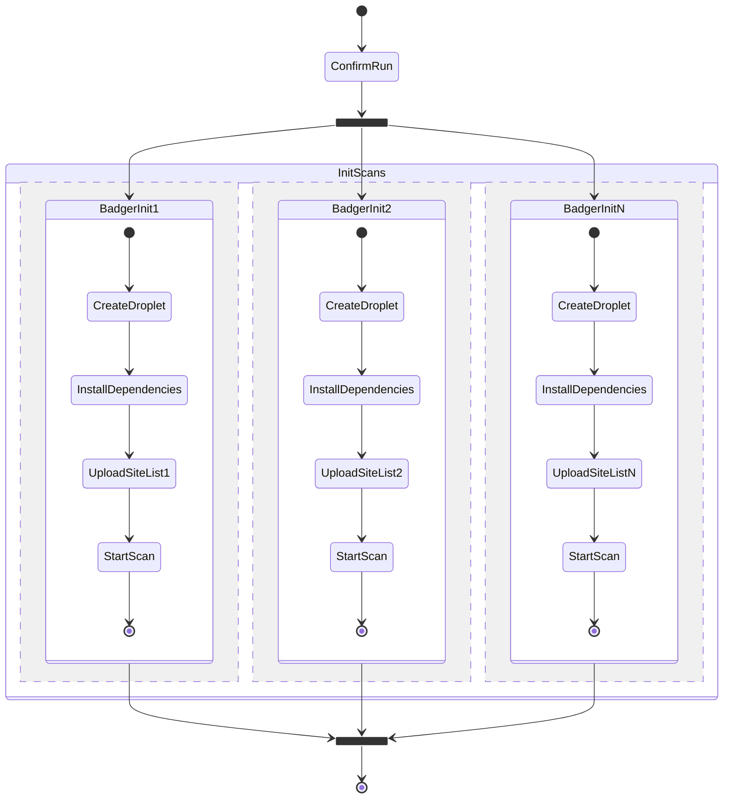
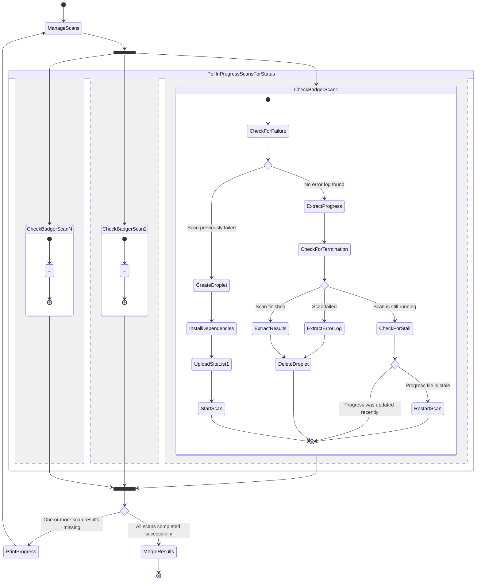

# Architecture

Once a run is confirmed, scans get initialized in parallel. Each scan instance receives their portion of the site list.

The run is now resumable. Scans are checked for progress and status (errored/stalled/complete) in parallel.

- If a scan fails, its instance is deleted and the scan gets reinitialized.
- When a scan fails to progress long enough, it is considered stalled. Stalled scans get restarted, which mostly means they get to keep going after skipping the site they got stuck on.
- When a scan finishes, the results are extracted and the instance is deleted.

This continues until all scans finish.

On completion scan results are merged by Privacy Badger as if each result was manually imported on the Manage Data tab on Privacy Badger's options page.
