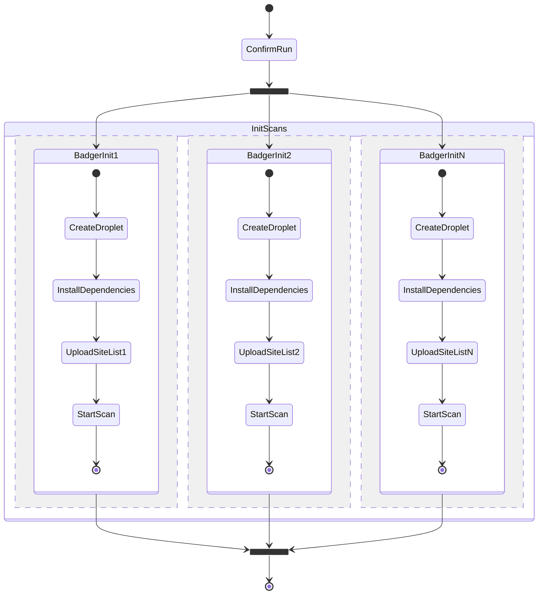
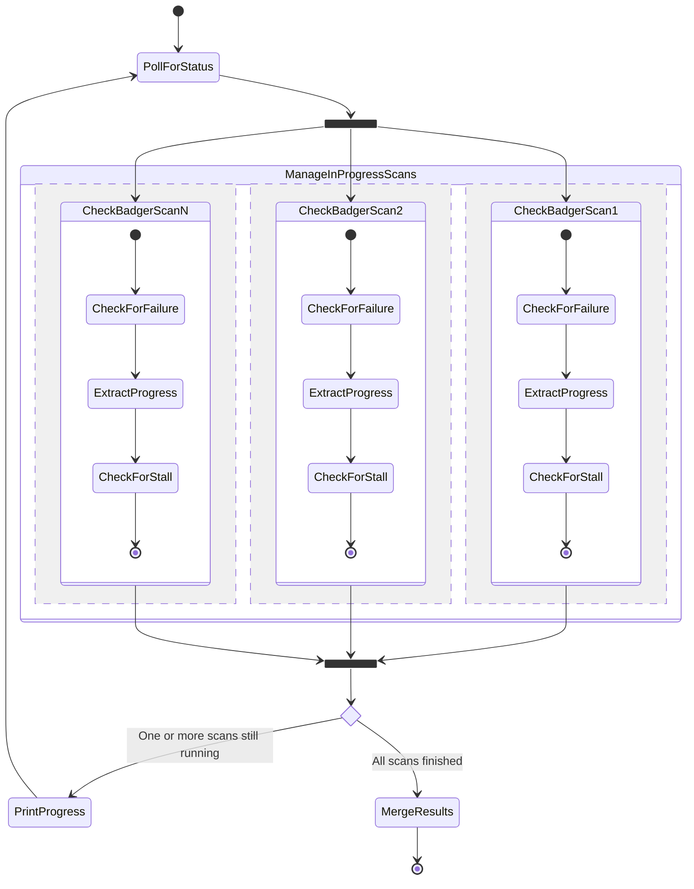

# Badger Swarm

Runs distributed [Badger Sett](https://github.com/EFForg/badger-sett) scans on Digital Ocean. Yes, a group of badgers is called a _cete_, but "swarm" just sounds better.

## Architecture

Badger Swarm converts a Badger Sett scan of X sites into N Badger Sett scans of X/N sites. This makes medium scans complete as quickly as small scans, and large scans complete in a reasonable amount of time.

Once a run is confirmed, scans get initialized in parallel. Each scan instance receives their portion of the site list.

The run is now resumable. Scans are checked for progress and status (errored/stalled/complete) in parallel.

- If a scan fails, its instance is deleted and the scan gets reinitialized.
- When a scan fails to progress long enough, it is considered stalled. Stalled scans get restarted, which mostly means they get to keep going after skipping the site they got stuck on.
- When a scan finishes, the results are extracted and the instance is deleted.

This continues until all scans finish.

On completion scan results are merged by Privacy Badger as if each result was manually imported on the Manage Data tab on Privacy Badger's options page.

## Setup

1. Check out this repository
2. [Install `doctl`](https://github.com/digitalocean/doctl#installing-doctl)
3. [Authenticate `doctl`](https://github.com/digitalocean/doctl#authenticating-with-digitalocean) with DigitalOcean
4. Copy `settings.ini.sample` to `settings.ini`
5. Review the settings. At minimum, specify your Digital Ocean SSH key (see `doctl compute ssh-key`). For Droplet sizes and hourly prices, see `doctl compute size list`.
6. To automatically merge results on completion, check out Badger Sett and [Privacy Badger](https://github.com/EFForg/privacybadger) (at the same directory level as this repository) and then [set up and activate a virtual environment](https://snarky.ca/a-quick-and-dirty-guide-on-how-to-install-packages-for-python/) for Badger Sett.
7. Run `./main.sh` to initiate a new run.

Once you are told the run is resumable, you can stop the script with <kbd>Ctrl</kbd>-<kbd>C</kbd> and then later resume the in-progress run with `./main.sh -r`.
